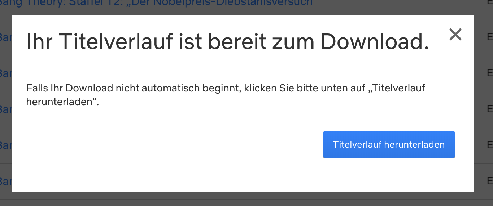
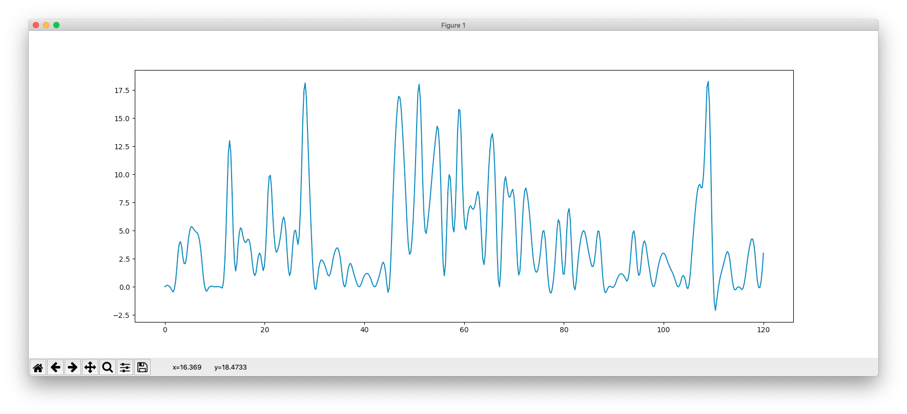
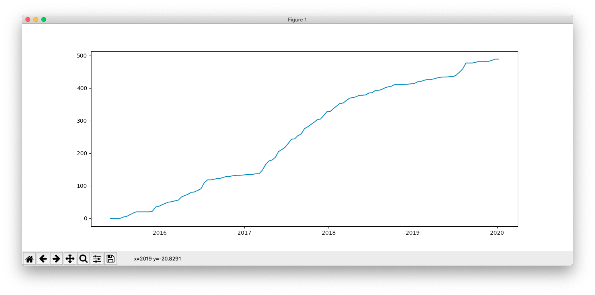

# Netflix Stats

Short written skript trying to analyze netflix consumption data. You can get a csv of all watched movies and episodes under you netflix account section on the website. This file is analyzed here. I am trying to get a brief insight into plotting the graphs with python. You can see some of the results thrown together here. Watching time is roughly eastimated for only the shows i watched.

I downloaded the data on the netflix website from here:

The skript can show your consumption data as graph:

Also it can view your total watching time:

